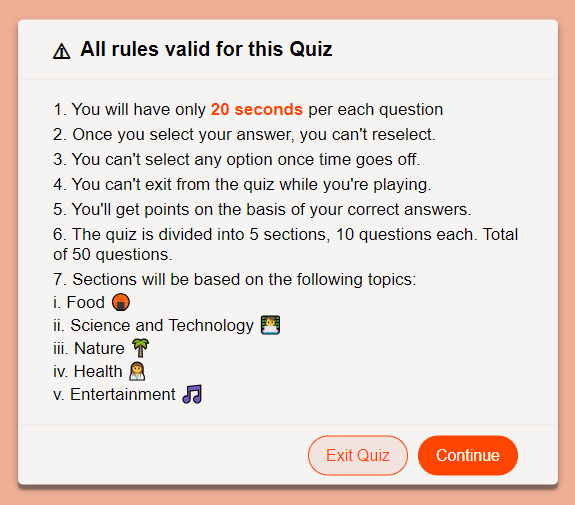
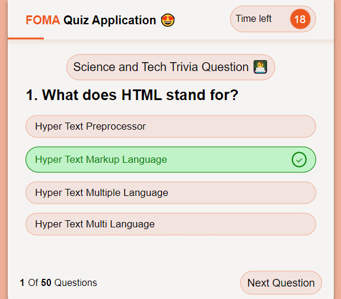

## Week 2: My second Assignment with Web3Bridge web2 advanced program.

# Project : Quiz Web App with Javascript

## Overview

### The challenge

Users should be able to:

- Answer Questions with in different categories
- See hover states for all interactive elements on the page
- replay quiz over again after first attempt

### Screenshot

### Links

- Live Site URL: ((https://foma-quiz-app.vercel.app/))

## My process

### Built with

- Semantic HTML5 markup
- CSS custom properties
- Flexbox
- Desktop workflow
- FontAwesome
- Vanilla Javascript

### What I learned

I learnt so much from this project from basic styling to Javascript DOM manipulation, Storing Data with Data Structures like Arrays ad Objects. I learnt how to integrate external resources into my project using fontawesome and uiball loaders.

### Continued development

I would love to continue development in DOM Manipulation

### Useful resources

- [Ui Ball](https://www.uiball.com) - This helped me in getting the loader i added in my project

## Author

- Twitter - [@Affiliate_Hima](https://www.twitter.com/Affiliate_Hima)
